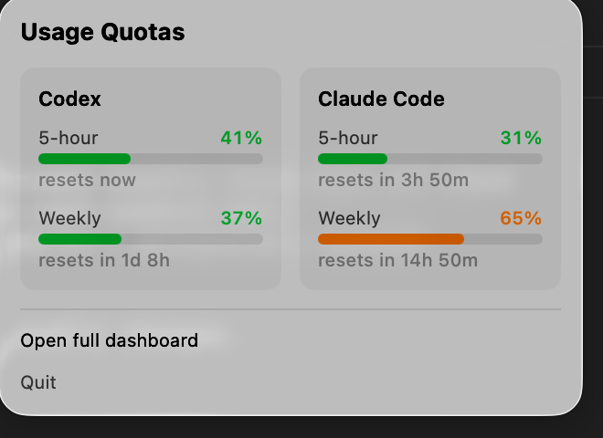
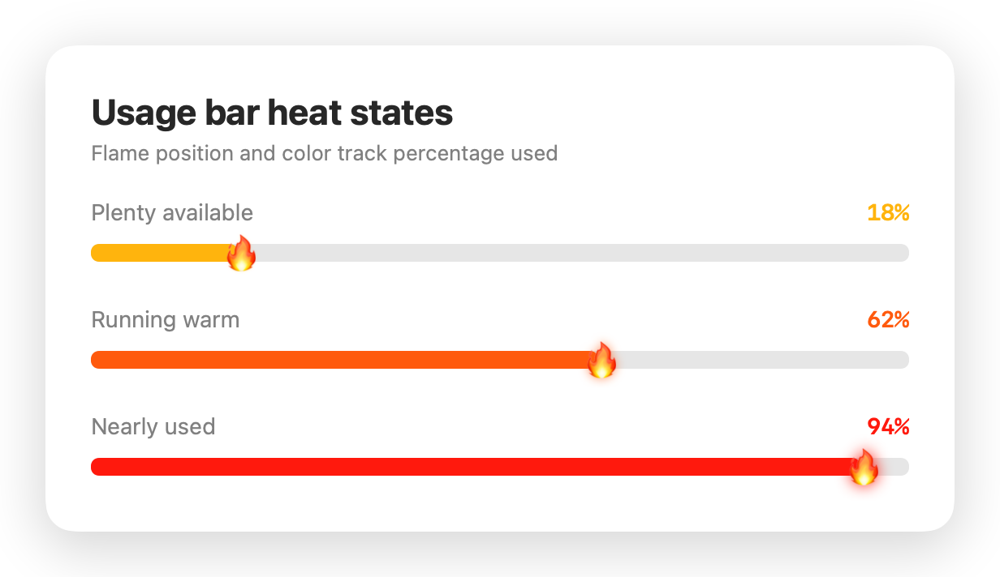

# usage-menubar

Native macOS menu bar app showing live Codex + account-wide Claude usage quotas.

Self-built replacement for [`shanggqm/codexU`](https://github.com/shanggqm/codexU) —
same idea, but self-hosted: no third-party binary. Claude usage comes directly
from Anthropic; Codex and fallback data come from local snapshot files.





## What it does

Menu bar label shows both providers' 5-hour usage at a glance. Click it for a
dropdown with 5-hour and weekly quota bars. Each bar heats from yellow to red
as usage rises, with a moving fire marker showing the exact percentage, plus a
live "resets in Xh Ym" countdown for each.

## How it works

Polls Anthropic's authenticated usage endpoint every 60s for account-wide
Claude usage (claude.ai plus Claude Code), using Claude Code's existing OAuth
credentials from macOS Keychain. Legacy file-based credentials remain supported.

Codex usage and Claude fallback data come from:

- `~/.claude/usage-dashboard/claude-rate-limits.json`
- `~/.claude/usage-dashboard/claude-rate-limits-merged.json`
- `~/.claude/usage-dashboard/codex-rate-limits.json`

These snapshots are written by the companion dashboard at `~/.claude/usage-dashboard/`
([theglove44/usage-dashboard](https://github.com/theglove44/usage-dashboard) —
see that repo for how the snapshots themselves get captured).

Only Anthropic's authenticated usage endpoint receives a network request. No
OAuth token leaves this Mac except in that request to Anthropic.

## Claude authentication

Sign Claude Code into the same Claude subscription used at claude.ai:

```bash
claude auth login --claudeai
claude auth status
```

`auth status` must report `"loggedIn": true`. Usage Menu Bar reads Claude
Code's OAuth credential from macOS Keychain and refreshes account usage within
60 seconds. If macOS asks for Keychain access, choose **Always Allow**.

When authentication or Anthropic is unavailable, the app keeps showing the
latest local Claude snapshot and displays a warning below the quota cards.

## Build & install

```
./rebuild.sh
```

Builds release, re-signs (adhoc), replaces `~/Applications/UsageMenuBar.app`,
relaunches it. Add it to Login Items (System Settings > General > Login Items)
to have it start on boot.

The dropdown's **Open Claude usage** button opens
`https://claude.ai/settings/usage`; it does not depend on a local dashboard
server.

See [CLAUDE.md](CLAUDE.md) for the file layout and editing notes.
