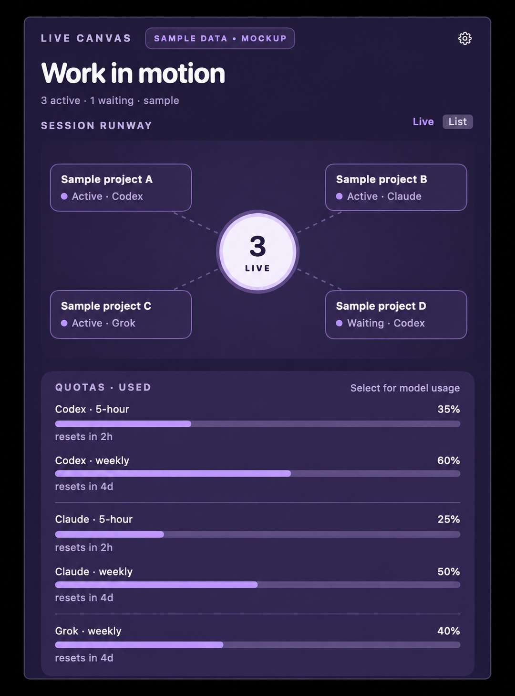
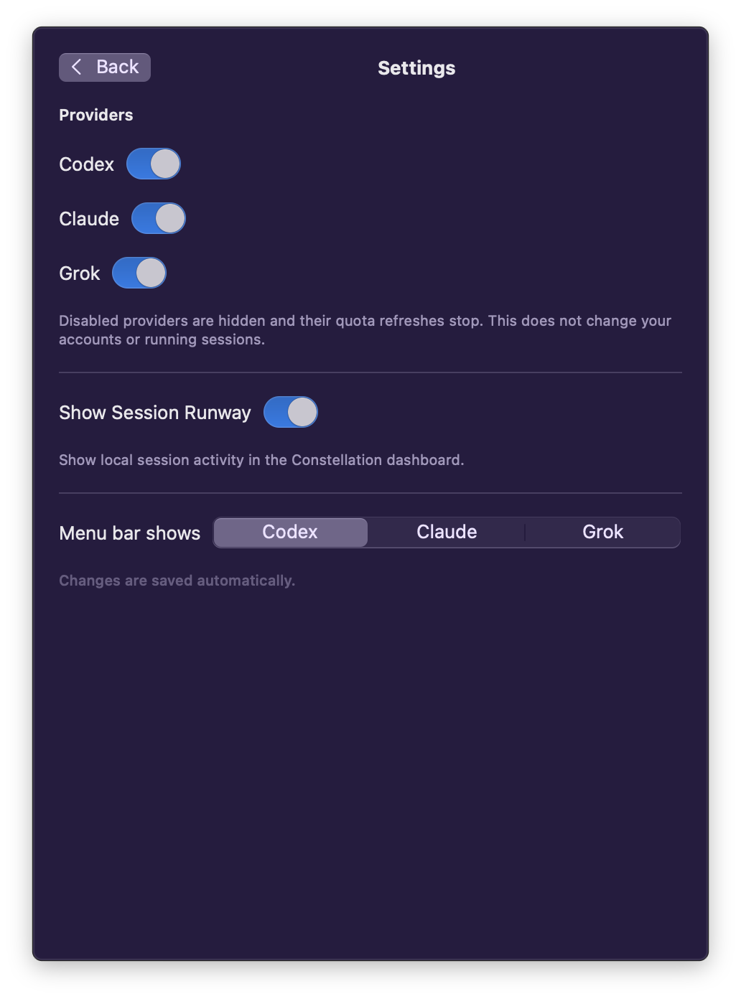

# usage-menubar

Native macOS menu bar app showing live Codex, account-wide Claude, and
account-wide Grok usage quotas.

Self-built replacement for [`shanggqm/codexU`](https://github.com/shanggqm/codexU) —
same idea, but self-hosted: no third-party binary. Claude usage comes directly
from Anthropic; Codex and fallback data come from local snapshot files.

## Screenshots

The dashboard mockup uses fictional sample data. It does not show live sessions,
local paths or account usage.





## What it does

The menu bar shows one selected provider as a coloured ten-block gauge and
percentage. Click it for the Constellation dashboard: a map of current local
sessions, with quota bars and reset countdowns below. Switch the map to
**List** for full session details and observed burn rates. The map shows up to
four live sessions; a note reports when more are hidden.

Open **Settings** in the dropdown to enable or disable Codex, Claude and Grok,
choose which enabled provider appears in the menu bar, and show or hide
**Session Runway**. Choices are saved automatically. Disabling a provider hides
its card and stops subsequent quota refreshes; an already-running request may
finish. This does not change accounts or terminate sessions. The runway switch
controls display only. All providers can be disabled without losing Settings.

Click a provider's **quota rows** for per-model token totals and estimated
API-equivalent cost in USD. Choose **Today**, **7 days** or **30 days**; use the
refresh button to reread local usage. Input, cached reads, cache writes and output
are shown separately. These are local records from this Mac, not account-wide
billing totals. Prices use a bundled standard short-context rate table checked
on **5 September 2026**. Unpriced models show **Price unavailable** and remain in
token totals. The cost subtotal explicitly identifies partial pricing.

See [Model usage and pricing](docs/model-usage.md) for sources, calculation rules
and coverage limits.

## How it works

Polls Anthropic's authenticated usage endpoint every five minutes for account-wide
Claude usage (claude.ai plus Claude Code), using Claude Code's existing OAuth
credentials from macOS Keychain. Before reporting an expired login, the app asks
the installed Claude CLI to renew its credentials and then retries once. Legacy
file-based credentials remain supported. Local snapshots are still checked every
60 seconds and take over when newer than cached account data. HTTP 429 responses
honour Anthropic's `Retry-After` value with a five-minute minimum backoff.

Codex usage and Claude fallback data come from:

- `~/.claude/usage-dashboard/claude-rate-limits.json`
- `~/.claude/usage-dashboard/claude-rate-limits-merged.json`
- `~/.claude/usage-dashboard/codex-rate-limits.json`

These snapshots are written by the companion dashboard at `~/.claude/usage-dashboard/`
([theglove44/usage-dashboard](https://github.com/theglove44/usage-dashboard) —
see that repo for how the snapshots themselves get captured).

Grok usage comes from the Grok CLI's own log at `~/.grok/logs/unified.jsonl`.
After each completed turn the CLI fetches the SuperGrok subscription's weekly
credit usage from xAI's billing service and logs it; the app reads the newest
of those entries every 60 seconds. The number is account-wide, but it only
refreshes while the Grok CLI is used on this Mac — the card shows a staleness
note when the last reading is over an hour old.

Only Anthropic's authenticated usage endpoint receives a network request. No
OAuth token leaves this Mac except in that request to Anthropic.

## Tests

```
./scripts/test.sh
```

The suite uses Swift Testing rather than XCTest, because the macOS
Command Line Tools no longer ship XCTest and this project deliberately avoids
requiring a full Xcode install. The script adds the framework search paths that
`swift test` does not supply on its own.

## Claude authentication

Sign Claude Code into the same Claude subscription used at claude.ai:

```bash
claude auth login --claudeai
claude auth status
```

`auth status` must report `"loggedIn": true`. Usage Menu Bar reads Claude
Code's OAuth credential from macOS Keychain and refreshes account usage within
60 seconds. The Claude CLI owns all OAuth renewal and Keychain writes. Background
refreshes never open a Keychain password dialog; if silent access is unavailable,
the app keeps using the latest local snapshot.

If the refresh token is absent, revoked, or expired, silent renewal is
impossible. The app keeps the latest snapshot and shows **Sign in to Claude**;
clicking it opens `claude auth login --claudeai` in Terminal.

When authentication or Anthropic is unavailable, the app keeps showing the
latest local Claude snapshot and displays a warning below the quota cards.

## Build & install

Create the persistent local signing identity once:

```
./scripts/create-local-signing-identity.sh
```

Then build or rebuild the app with:

```
./rebuild.sh
```

Builds release, signs it with the persistent local identity, replaces
`~/Applications/UsageMenuBar.app`, and relaunches it. Stable signing lets macOS
recognise later rebuilds as the same app, so Keychain approval survives updates.
Add it to Login Items (System Settings > General > Login Items) to have it start
on boot.

The dropdown's **Open Claude usage** button opens
`https://claude.ai/settings/usage`; it does not depend on a local dashboard
server.

See [CLAUDE.md](CLAUDE.md) for the file layout and editing notes.
