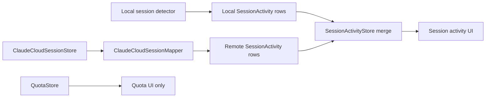

# Optional Claude cloud-session rows

Status: later-phase implementation plan. No network behavior belongs in the
current change.

This plan covers optional rows for Claude sessions running in Anthropic's cloud
environment. It does not change the existing account-wide Claude quota path,
and it does not make a request to `claude.ai`.

## Decision

Keep this feature separate from current quota polling and local session
discovery. Ship only after:

1. the credential UX and privacy copy are approved;
2. the undocumented endpoint is isolated behind fixtures and mocked
   `URLSession` tests;
3. the local `SessionActivity` merge boundary exists;
4. stale and failure states are visible and tested; and
5. a security review confirms that the web cookie cannot enter logs,
   `UserDefaults`, crash metadata, or the OAuth path.

Recommendation: later phase, behind an opt-in setting that defaults to off.
The endpoint is undocumented, the credential is a browser bearer cookie, and
enabling it changes this app's current network/privacy promise.

## Findings from current code

### `usage-menubar`

- [`ClaudeServices.swift`](../Sources/UsageMenuBar/ClaudeServices.swift) reads
  Claude Code OAuth credentials from the `Claude Code-credentials` Keychain item
  and the legacy `~/.claude/.credentials.json` fallback. It sends an OAuth
  access token as `Authorization: Bearer ...` to Anthropic's OAuth usage
  endpoint. Claude CLI owns OAuth renewal.
- [`QuotaStore.swift`](../Sources/UsageMenuBar/QuotaStore.swift) turns that
  response into account-wide quota data. It has no session-list model and no
  local `SessionActivity` type at this commit.
- [`Models.swift`](../Sources/UsageMenuBar/Models.swift) contains provider
  quota models, not live session rows. Do not overload `ProviderQuota` with
  remote session identity or transport state.
- The current app has no cloud-session network client, no `sessionKey` storage,
  and no local/remote session-row merger. Those are future seams, not reasons
  to put cloud logic into `QuotaStore`.

### `jazzyalex/agent-sessions` reference

The shallow clone inspected for this plan was at commit
`cea8cc0ea559aecc4a03a3e1030415b72e960519` (2026-08-01). Relevant source and
design files:

- [`ClaudeCloudAPIClient.swift`](https://github.com/jazzyalex/agent-sessions/blob/cea8cc0ea559aecc4a03a3e1030415b72e960519/AgentSessions/ClaudeCloud/ClaudeCloudAPIClient.swift)
- [`ClaudeCloudSessionCatalog.swift`](https://github.com/jazzyalex/agent-sessions/blob/cea8cc0ea559aecc4a03a3e1030415b72e960519/AgentSessions/ClaudeCloud/ClaudeCloudSessionCatalog.swift)
- [`ClaudeCloudHUDRowMapper.swift`](https://github.com/jazzyalex/agent-sessions/blob/cea8cc0ea559aecc4a03a3e1030415b72e960519/AgentSessions/ClaudeCloud/ClaudeCloudHUDRowMapper.swift)
- [`ClaudeManualWebCookie.swift`](https://github.com/jazzyalex/agent-sessions/blob/cea8cc0ea559aecc4a03a3e1030415b72e960519/AgentSessions/ClaudeStatus/ClaudeOAuth/ClaudeManualWebCookie.swift)
- [`ClaudeCloudSourceState.swift`](https://github.com/jazzyalex/agent-sessions/blob/cea8cc0ea559aecc4a03a3e1030415b72e960519/AgentSessions/ClaudeCloud/ClaudeCloudSourceState.swift)
- [source design](https://github.com/jazzyalex/agent-sessions/blob/cea8cc0ea559aecc4a03a3e1030415b72e960519/docs/superpowers/specs/2026-07-31-claude-cloud-session-source-design.md)

That code is useful precedent, not an API guarantee. Its current design keeps
cloud polling, filtering, state, and row mapping in a dedicated subsystem and
leaves process/path fields nil.

## Two unrelated Claude authentication surfaces

| Surface | Existing local quota path | Future cloud-session path |
| --- | --- | --- |
| Credential | Claude Code OAuth access/refresh credential | `claude.ai` browser `sessionKey` cookie |
| Storage | Claude Code's Keychain item, with legacy file fallback | Separate UsageMenuBar-owned Keychain item; never the OAuth item |
| Request | `Authorization: Bearer <access token>` | `Cookie: sessionKey=<session key>` |
| Host | `api.anthropic.com` | `claude.ai` |
| Purpose | Account-wide usage windows | List remote Claude Code sessions |
| Renewal | Claude CLI `auth status` / login flow | No CLI OAuth renewal; user replaces the cookie in Settings |
| Scope | Usage data, including Claude.ai and Claude Code account usage | Remote session metadata only |
| Failure meaning | OAuth expiry/login state | Web-cookie expiry, offline, rate limit, or API drift |

Never use the OAuth access token as a web cookie. Never ask Claude CLI to refresh
the `sessionKey`. A successful OAuth quota request does not prove that the web
cookie is valid, and a valid web cookie does not replace Claude Code OAuth.

The first implementation should use explicit manual paste. Do not scrape
Safari or another browser's cookie store. Browser cookie locations and macOS
TCC behavior vary, and automatic extraction would expand both permissions and
credential exposure without improving the core row feature.

## Undocumented `claude.ai` contract

The reference implementation currently performs two read-only requests.
Contract details below are observed behavior, not an Anthropic-supported API.

### Organization lookup

```text
GET https://claude.ai/api/organizations
Cookie: sessionKey=<stored web cookie>
Accept: application/json
User-Agent: usage-menubar/<version>
```

Use the first organization object's `uuid`; tolerate `id` only as a narrowly
documented compatibility fallback if fixtures prove it is needed. Cache the
organization ID in memory for the client lifetime. Never persist it with the
cookie.

### Session list

```text
GET https://claude.ai/v1/code/sessions?limit=100[&cursor=<next_cursor>]
Cookie: sessionKey=<stored web cookie>
Accept: application/json
User-Agent: usage-menubar/<version>
anthropic-version: 2023-06-01
anthropic-beta: ccr-byoc-2025-07-29
anthropic-client-feature: ccr
x-organization-uuid: <organization UUID>
```

Expected envelope:

```json
{
  "data": [],
  "next_cursor": "optional cursor",
  "resume_token": "optional/unknown"
}
```

Read only the fields needed for a row. Current reference code observes:

`id`, `title`, `status`, `status_bucket`, `worker_status`,
`connection_status`, `environment_kind`, `last_event_at`, and `unread`.

Recommended parser rules:

- Require a top-level `data` array. Treat a missing or wrong envelope as
  contract drift.
- Skip an individual object with no non-empty `id`; do not blank the batch for
  one malformed row. If a non-empty page contains no decodable IDs, classify
  the page as drift so a schema change cannot look like a clean empty result.
- Parse fractional and non-fractional ISO-8601 timestamps. A timestamp parse
  failure removes only the timestamp, not the row.
- Follow `next_cursor` for at most three pages per poll (300 rows). Do not
  follow a cursor forever and do not use long-poll parameters.
- Ignore unknown response fields. Do not fetch transcripts, message bodies,
  `safety_flags`, or per-session detail endpoints.

### Selection and likely drift points

Filter on `environment_kind == "anthropic_cloud"`. Do not filter on the
`cse_` ID prefix: the reference corpus found that both cloud and bridge rows
share that prefix. Excluding `bridge` prevents duplicate display of sessions
already visible through local files.

For a first implementation, use the reference liveness rule as a named,
fixture-backed policy:

- retain `status == "active"` only;
- retain a row when `worker_status == "running"` **or**
  `last_event_at` is within one hour of the poll clock;
- treat a missing timestamp as not recent;
- use `status_bucket` for presentation (`working`, `review_ready`, and other
  observed values), not as the sole liveness signal;
- when `worker_status == "WORKER_STATUS_UNSPECIFIED"`, use a recent
  `status_bucket == "working"` as a fallback for the working badge;
- keep disconnected/review/unread information as row presentation metadata;
  do not discard a row solely because it is disconnected if it still passes
  the active predicate.

This policy is empirical. `status == active` has been observed to mean “not
archived,” not “currently running,” and old sessions have reported misleading
working buckets. Keep the policy in pure functions so changed server semantics
require fixture updates and review, not scattered conditionals.

Likely drift points:

- endpoint path, host, or organization lookup shape;
- required beta/client headers and their accepted values;
- `data`/cursor envelope, cursor naming, page limit, or pagination behavior;
- renamed, removed, or newly nested row fields;
- timestamp precision, timezone, or nullability;
- status and worker enum vocabulary or the meaning of `active`;
- `environment_kind` values, especially the cloud/bridge split;
- 401 versus 403 behavior at authentication and Cloudflare edges;
- `Retry-After` format and rate-limit policy;
- whether a browser cookie is accepted from this app's `URLSession` at all.

The client must fail closed: drift must produce a visible state and must not
turn unknown data into apparently live local work.

## Future ownership and integration boundary

Current `usage-menubar` has no `SessionActivity` model. Define that boundary
before adding the cloud source. If a parallel local-session feature creates the
type first, the cloud work must consume that type rather than introduce a
second row model.



Proposed ownership:

| Future path | Owner | Responsibility | Explicit non-responsibility |
| --- | --- | --- | --- |
| `Sources/UsageMenuBar/SessionActivity.swift` | Local session feature | Provider-neutral row contract; represent local vs remote origin | No network and no credential reads |
| `Sources/UsageMenuBar/ClaudeCloudModels.swift` | Cloud feature | Raw DTOs, reduced cloud row, source error/state, freshness metadata | No SwiftUI and no local process probing |
| `Sources/UsageMenuBar/ClaudeCloudCredentials.swift` | Cloud feature/security owner | Paste parser, Keychain protocol, separate Keychain item, clear/read/write | No OAuth fallback, no plaintext persistence, no browser scraping in phase 1 |
| `Sources/UsageMenuBar/ClaudeCloudClient.swift` | Cloud feature | `URLSession` actor, org lookup, paginated GET, decoding, HTTP mapping | No timers, UI, quota mutation, or transcript requests |
| `Sources/UsageMenuBar/ClaudeCloudSessionStore.swift` | Cloud feature | Opt-in gate, 30–60s polling, one-flight guard, stale cache, state machine | No local row discovery and no quota ownership |
| `Sources/UsageMenuBar/ClaudeCloudSessionMapper.swift` | Cloud feature | Map reduced remote rows to `SessionActivity` | No fabricated local identity fields |
| `Sources/UsageMenuBar/SessionActivityStore.swift` | Local session feature | Merge local rows plus mapper output, stable ordering, ID collision guard | No HTTP or cookie logic |
| `Sources/UsageMenuBar/UsageMenuBarApp.swift` | App composition owner | Construct stores and inject dependencies | No endpoint details |
| `Sources/UsageMenuBar/QuotaStore.swift` | Existing quota owner | Keep account-wide OAuth quota polling unchanged | Do not fetch cloud sessions or hold web cookies |
| `Sources/UsageMenuBar/QuotaView.swift` | UI owner | Keep quota cards separate; render session section/status if product keeps it in this menu | Do not infer remote rows from quota staleness |

Required `SessionActivity` semantics:

- Remote ID: `claude-cloud:<server session id>`; stable and namespaced.
- Origin: explicit `.claudeCloud`/remote value, not merely `.claude` if the
  shared model supports a surface field. This prevents local resume logic from
  treating a remote row as a local transcript.
- Remote fields: title, active/idle/review state, unread count,
  `lastActivityAt`, source freshness, and stale marker.
- Local-only fields: `pid`, `tty`, terminal program, `cwd`, log path, local
  session file, local resume command, and local reveal URL all remain `nil`.
- Remote rows must be non-navigable unless a future, explicitly designed cloud
  action is added. Do not fabricate a PID, TTY, process name, cwd, log, or
  terminal command.
- Merge by origin-qualified ID. Never deduplicate by title, cwd, timestamp, or
  the `cse_` prefix. The `environment_kind` filter is what keeps bridge rows
  out of this source.
- A successful list is authoritative for membership: a missing remote ID is
  removed on the next successful poll. Do not retain a vanished row merely
  because its old `last_event_at` was recent.

## Credential storage and explicit opt-in

1. Add a setting named plainly, for example **Show Claude cloud sessions**.
   Default `false`. The default path must not read the cloud Keychain item,
   open a network connection, or show an auth prompt.
2. Explain the consequence beside the setting: “Sends a browser session cookie
   to claude.ai to read remote session metadata.” Link to privacy details.
3. Accept a manually pasted bare `sessionKey`, `sessionKey=...` pair, or full
   `Cookie:` header. Extract only the exact `sessionKey` pair; reject empty or
   unrelated cookie input. Never echo the value after paste.
4. Store only the extracted value in a separate generic-password Keychain item,
   for example service `UsageMenuBar.claude-cloud` and account
   `sessionKey`, with `kSecAttrAccessibleAfterFirstUnlockThisDeviceOnly`.
   Keep the service/account constants in `ClaudeCloudCredentials.swift`.
5. Never write the cookie to `UserDefaults`, JSON snapshots, temporary files,
   debug files, URL logs, analytics, or error strings. Do not include it in
   `URLRequest` descriptions or thrown error messages.
6. Send the cookie only to the allowlisted `claude.ai` host. Do not follow
   arbitrary redirects carrying the cookie; reject or constrain redirects to
   the same host.
7. Provide **Clear Claude cloud-session cookie**. Clearing the cookie disables
   requests immediately and removes remote rows.
8. Do not reuse `Claude Code-credentials`, the OAuth access token, the OAuth
   refresh flow, or the local snapshot files for this feature.

## Polling, freshness, and failure states

Use a dedicated `@MainActor` store with an injected clock and a 45-second
nominal interval. This is inside the requested 30–60-second range while
leaving room for timer tolerance. Poll only while the feature is enabled and a
cookie exists. Add an immediate first refresh after the user enables the
feature or saves a new cookie; do not poll on every view evaluation.

Rules:

- Keep one request in flight. A slow request must not create overlapping polls.
- Use an ephemeral `URLSession`; request timeout around 8–10 seconds and a
  resource timeout around 12 seconds.
- Respect `Retry-After` on 429. Suspend until that time, with a defensive
  minimum delay. Do not hammer the endpoint at the normal interval during a
  rate-limit episode.
- Transport failures may retry at the next scheduled tick with bounded
  backoff. “Offline” means no usable network response, not “the server sent
  an unknown JSON shape.”
- Keep `lastSuccessfulPollAt` separate from each row's `lastEventAt`. A recent
  server event does not make an old fetch fresh.
- During offline or rate-limited periods, retain the last successful rows only
  as stale rows, with “last updated” age visible. A stale row must never look
  like a fresh local process. Apply a finite display-age cap (recommendation:
  10 minutes) before clearing stale rows if no successful refresh returns.
- On a successful response, replace the complete remote set and clear stale
  state. An empty filtered result is a successful `.empty` state, not an
  authentication failure.
- Clear rows immediately for missing cookie, 401/expired, or contract drift;
  these conditions make the old set unsafe to present as current. Keep the
  failure message visible.
- Treat 403 as a transient/offline-style failure unless a fixture and verified
  response establish that it means expired credentials. Do not turn one edge
  challenge into a destructive logout.

Minimum state vocabulary:

| State | Rows | User-facing meaning |
| --- | --- | --- |
| `disabled` | none | Cloud rows off; no request made |
| `notConnected` | none | No web cookie stored |
| `ready(count)` | fresh rows or none | Last list succeeded |
| `empty` | none | List succeeded; no active cloud rows |
| `offline` | stale rows until age cap | Network unavailable; retrying |
| `rateLimited(until)` | stale rows until age cap | Server asked client to wait |
| `expired` | none | Cookie rejected; replace it |
| `contractDrift` | none | Response/API no longer matches parser |
| `requestFailed` | stale rows only if clearly transient | Unexpected server/client failure |

Every state needs distinct, non-empty UI copy. Do not show a perpetual
“reconnecting” spinner without the actual cause.

## Privacy and documentation changes required before enabling

This repository currently says Claude network activity is limited to the
Anthropic OAuth usage request. That statement becomes false when cloud rows are
implemented. Update all of the following in the implementation phase:

- `README.md`: disclose the opt-in setting, `claude.ai` host, the two GET
  paths, 45-second polling, Keychain-only cookie storage, and the exact remote
  metadata read (`id`, title, state/status, unread count, timestamps, and
  environment kind). State that the app does not read or upload transcripts,
  prompts, tool output, source code, cwd, local logs, or process data.
- `CLAUDE.md`: update the “How it works” and network statements so they name
  both independent Claude auth paths and say the cloud path is disabled by
  default. Document that local OAuth renewal remains Claude CLI-owned.
- `docs/security.md` (new, or the repository's then-current security doc):
  record the `sessionKey` threat model, separate Keychain item, no-log rule,
  same-host redirect rule, clear-cookie behavior, stale-row policy, and the
  undocumented-contract risk.
- Settings UI copy: repeat the disclosure at the opt-in control and expose
  clear-cookie status. “Connected” must mean a stored web cookie, not merely
  Claude Code OAuth login.
- Error copy: never include a URL request dump, cookie fragment, response body,
  or organization identifier in user-visible diagnostics.

Do not claim “no network calls” or “only Anthropic OAuth” after this feature is
enabled. Keep the existing account-wide OAuth disclosure intact and separate.

## Test strategy

No test may contact `claude.ai`, and no fixture may contain a real cookie,
OAuth token, organization ID, or user data. Use synthetic placeholders only.

### Client and contract fixtures

Add fixtures under:

`Tests/UsageMenuBarTests/Fixtures/ClaudeCloud/`

Suggested files:

- `organizations-first.json`
- `sessions-page.json`
- `sessions-page-2.json`
- `sessions-empty.json`
- `sessions-malformed-envelope.json`
- `sessions-mixed-rows.json`
- `sessions-unknown-fields.json`
- `sessions-timestamp-forms.json`

Use a custom `URLProtocol` in `ClaudeCloudURLProtocol.swift` and an ephemeral
test `URLSessionConfiguration` to assert method, host, path, query, headers,
and response sequencing. Do not substitute a closure-only fake for all client
tests: the request boundary must be tested.

Client tests must cover:

- organization lookup followed by sessions request;
- exact cookie/header placement without an OAuth `Authorization` header;
- GET-only requests, no request body, allowlisted hosts, and bounded pages;
- cursor pagination and maximum-page cutoff;
- unknown additive fields;
- fractional/plain/null timestamps;
- missing IDs skipped, malformed envelope rejected, all-bad non-empty page
  classified as drift;
- 200, 401, 403, 429 with delta seconds, 429 with HTTP date, 5xx, timeout,
  DNS/offline, and invalid JSON;
- no client construction or request when feature is disabled or cookie absent.

### Credential tests

Use an in-memory `ClaudeSecretStore` double. Test exact `sessionKey` extraction
from a bare token, a pair, and a full cookie header; reject unrelated cookie
names and empty values. Assert save/clear behavior, separate service/account
constants, and that diagnostics never contain the secret. Do not test against
the real Keychain item or read browser cookie files.

### Selection and state tests

Use an injected `now` value and fixture rows for:

- `anthropic_cloud`, `bridge`, absent environment kind, and shared `cse_`
  prefixes;
- archived versus active;
- running worker, idle recent event, idle stale event, missing timestamp, and
  unspecified worker status;
- review-ready, disconnected, unread, missing title, and unknown bucket;
- successful replacement, remote disappearance, empty success, offline stale
  retention/age cap, rate-limit retry time, expired clearing, contract-drift
  clearing, and recovery.

Add a timer/poll test for one-flight behavior, 30–60-second cadence, immediate
enable refresh, disabled no-op, and `Retry-After` suppression.

### `SessionActivity` boundary tests

Create one local synthetic row and one cloud synthetic row with the same human
title. Assert:

- both survive merge;
- cloud ID is namespaced and stable;
- cloud `pid`, `tty`, terminal, cwd, log path, resume command, and reveal URL
  are nil;
- local row fields remain unchanged;
- cloud rows are removed after a successful response omits them;
- stale cloud rows are visibly marked and cannot be treated as active local
  processes;
- quota polling still succeeds when cloud client returns every failure state,
  and cloud failures do not alter `ProviderQuota`.

Run `swift test` with network-disabled fixtures only. No release build should
be considered evidence of contract validity; contract tests prove parser and
request behavior, not server support.

## Implementation sequence and gates

1. Define/agree `SessionActivity` origin and optional local-field semantics.
2. Add pure cloud DTOs, state, filter, and mapper tests using fixtures.
3. Add separate Keychain credential abstraction and opt-in UI copy; test with
   an in-memory secret store.
4. Add the `URLSession` client and `URLProtocol` tests. Keep the endpoint code
   read-only and isolated.
5. Add the 45-second store, stale cache, backoff, and state tests.
6. Add the adapter into `SessionActivityStore`; verify local rows and
   `QuotaStore` remain independent.
7. Add the session UI/status surfaces with no local navigation affordances.
8. Update README, CLAUDE, security docs, and settings disclosure.
9. Run full tests, inspect the diff for credential-bearing strings, and obtain
   explicit approval before any live manual probe. A live probe, if ever
   approved, must use a disposable account/session and never be part of tests.

## Risks and final recommendation

| Risk | Impact | Mitigation |
| --- | --- | --- |
| Undocumented endpoint drifts | Rows disappear or misclassify | Isolated client, fixtures, visible contract-drift state, bounded retries |
| `sessionKey` is bearer-like | Account exposure if leaked | Explicit paste, separate Keychain item, no logs/files, clear action |
| OAuth and cookie paths get conflated | Broken auth or accidental credential disclosure | Separate files, types, headers, tests, and UI copy |
| Cloud rows look local | Misleading PID/cwd/log/resume actions | Remote origin, namespaced ID, all local fields nil |
| Offline data looks fresh | Stale activity misleads user | Separate poll freshness from event time, visible stale label, age cap |
| Bridge rows duplicate local rows | Confusing duplicate activity | Exact `environment_kind` filter and merge tests |
| New network behavior violates docs | Privacy expectation mismatch | README/CLAUDE/security updates required before enabling |

Keep this feature as a later phase. Current quota behavior is useful and
well-tested without it; cloud rows add a sensitive undocumented integration
with limited product value beyond visibility. Revisit after the local
`SessionActivity` model and UI exist, so the cloud source can remain a narrow
read-only provider instead of reshaping the quota app.

## Files changed in this planning pass

- Added [`docs/claude-cloud-session-plan.md`](claude-cloud-session-plan.md).
- No Swift source, tests, project file, README, or credential store changed.
